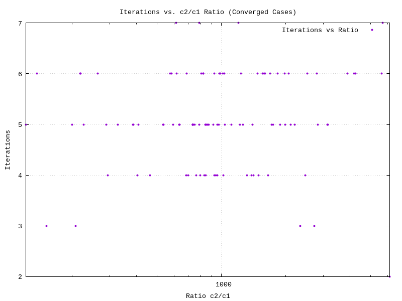
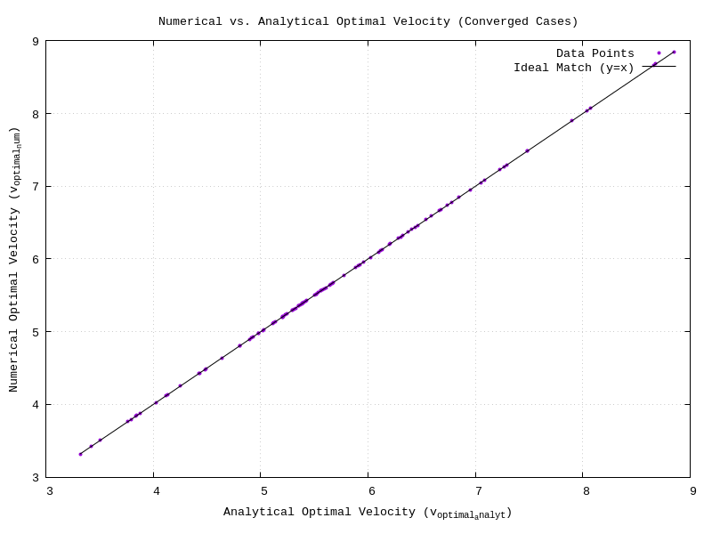
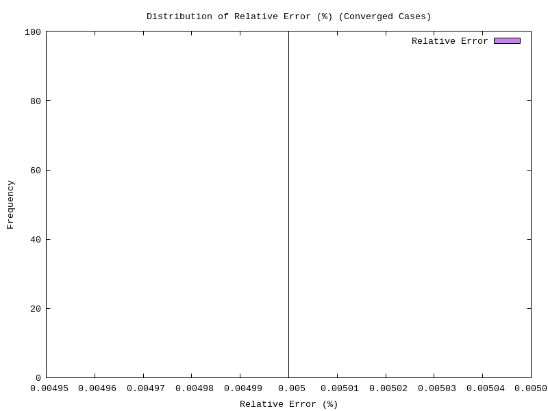
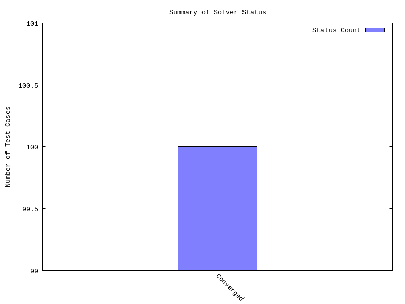

# Implementasi Metode Newton-Raphson untuk Optimasi Kecepatan Drone

## Deskripsi Proyek

Proyek ini mengimplementasikan metode Newton-Raphson dalam bahasa C++ untuk menentukan kecepatan optimal drone guna memaksimalkan jangkauan operasional. Program menyelesaikan persamaan non-linear yang merepresentasikan kondisi optimal dalam operasi penerbangan drone.

## Tim Pengembang

- **Andi Muhammad Alvin Farhansyah** (NPM: 2306161933)
- **Rowen Rodotua Harahap** (NPM: 2306250604)
- **Ryan Adidaru Excel Barnabi** (NPM: 2306266994)
- **Daffa Sayra Firdaus** (NPM: 2306267151)
- **Fathan Yazid Satriani** (NPM: 2306250560)

**Universitas Indonesia**

## Model Matematika

### Model Daya Drone
```
P(v) = c₁v³ + c₂/v
```

### Fungsi Optimasi
Untuk memaksimalkan jangkauan, dicari akar dari:
```
f(v) = d(P(v)/v)/dv = 2c₁v - 2c₂v⁻³ = 0
```

Dengan turunan:
```
f'(v) = 2c₁ + 6c₂v⁻⁴
```

### Solusi Analitik
```
v_optimal = (c₂/c₁)^(1/4)
```

## Struktur File (Dalam Github Repo)

```
├── Drone.cpp              # Program utama implementasi Newton-Raphson
├── data.cpp              # Generator data sintetis
├── synthetic_data.txt    # File data input (dihasilkan oleh data.cpp)
├── README.md            # Dokumentasi proyek
├── plot_iterations_distribution(1).png          # Grafik distribusi iterasi
├── plot_iterations_vs_c2_c1_ratio.png          # Grafik iterasi vs rasio
├── plot_numerical_vs_analytical_velocity.png   # Grafik perbandingan numerik vs analitik
├── plot_relative_error_distribution.png        # Grafik distribusi error
└── plot_solver_status_summary.png              # Grafik status solver
```

## Instalasi dan Kompilasi

### Prerequisites
- Compiler C++ (g++, clang++, atau MSVC)
- C++11 atau versi lebih baru

### Kompilasi
```bash
# Kompilasi generator data
g++ -o generate_data data.cpp

# Kompilasi program utama
g++ -o main main.cpp
```

## Cara Penggunaan

### 1. Generate Data Sintetis
```bash
./generate_data
```
Program akan meminta jumlah set data yang ingin dihasilkan. Data akan disimpan dalam file `synthetic_data.txt`.

### 2. Jalankan Optimasi
```bash
./main
```
Program akan membaca data dari `synthetic_data.txt` dan menampilkan hasil optimasi dalam bentuk tabel.

### Format Data Input
Setiap baris dalam `synthetic_data.txt` berisi:
```
c1 c2 v0_initial epsilon max_iterations
```

Contoh:
```
0.26381 287.17778 6.10830 0.00001 100
0.11090 332.90108 7.66800 0.00001 100
```

## Parameter Input

- **c₁**: Koefisien gaya hambat parasitik (> 0)
- **c₂**: Koefisien gaya hambat terinduksi (> 0)
- **v₀**: Tebakan awal kecepatan (> 0)
- **ε**: Toleransi konvergensi (default: 10⁻⁵)
- **max_iter**: Maksimum iterasi (default: 100)

## Output Program

Program menghasilkan tabel ringkasan yang mencakup:

| Kolom | Deskripsi |
|-------|-----------|
| c1, c2 | Parameter input |
| v0_initial | Tebakan awal |
| v_optimal_num | Kecepatan optimal (numerik) |
| Iterations | Jumlah iterasi untuk konvergensi |
| v_optimal_analyt | Kecepatan optimal (analitik) |
| Rel.Error (%) | Kesalahan relatif |
| Status | Status konvergensi |

### Contoh Output
```
--- Summary Table of Newton-Raphson Results for Drone Optimization ---
        c1         c2      v0_initial   v_optimal_num  Iterations  v_optimal_analyt   Rel.Error (%)         Status
-----------------------------------------------------------------------------------------------------------------------
  0.26381    287.17778        6.10830         5.74416           5         5.74416         0.00000           Converged
  0.11090    332.90108        7.66800         7.39808           6         7.39808         0.00000           Converged
```

## Algoritma Newton-Raphson

```cpp
while (iter < max_iter) {
    f_val = f(v_current)
    df_val = f'(v_current)
    
    if (|df_val| < threshold) return "Derivative Zero"
    
    v_next = v_current - f_val / df_val
    
    if (v_next <= 0) return "Non-Positive Velocity"
    
    if (|v_next - v_current| < tolerance) return "Converged"
    
    v_current = v_next
    iter++
}
```

## Kriteria Konvergensi

1. **Converged**: |v_{i+1} - v_i| < ε
2. **Max Iterations Reached**: Mencapai batas iterasi maksimum
3. **Derivative Zero**: Turunan terlalu kecil (< 10⁻¹⁰)
4. **Non-Positive Velocity**: Kecepatan menjadi non-positif
5. **Invalid Parameters**: Parameter input tidak valid

## Fitur Program

- ✅ Implementasi metode Newton-Raphson yang robust
- ✅ Penanganan berbagai kondisi error
- ✅ Perbandingan dengan solusi analitik
- ✅ Perhitungan kesalahan relatif
- ✅ Output terformat dalam tabel
- ✅ Generator data sintetis
- ✅ Validasi parameter input

## Analisis Hasil

Program menghasilkan visualisasi untuk analisis:

### 1. Distribusi Iterasi Konvergensi
.png)

Histogram yang menunjukkan jumlah iterasi yang dibutuhkan untuk mencapai konvergensi across berbagai test cases.

### 2. Iterasi vs Rasio c₂/c₁


Scatter plot yang menunjukkan korelasi antara rasio parameter c₂/c₁ dan jumlah iterasi yang dibutuhkan untuk konvergensi.

### 3. Perbandingan Numerik vs Analitik


Scatter plot yang membandingkan hasil kecepatan optimal dari metode Newton-Raphson (numerik) dengan solusi analitik v = (c₂/c₁)^(1/4).

### 4. Distribusi Error Relatif


Histogram yang menunjukkan distribusi kesalahan relatif antara solusi numerik dan analitik, mendemonstrasikan akurasi metode Newton-Raphson.

### 5. Status Solver Summary


 distribusi status konvergensi solver (Converged, Max Iterations, Error conditions, dll.)

## Validasi

- Solusi numerik dibandingkan dengan solusi analitik v = (c₂/c₁)^(1/4)
- Kesalahan relatif umumnya < 0.001%
- Konvergensi dalam 3-8 iterasi untuk mayoritas kasus

## Troubleshooting

### Error: File tidak ditemukan
```bash
Error: Tidak dapat membuka file input: synthetic_data.txt
```
**Solusi**: Jalankan `./generate_data` terlebih dahulu.

### Error: Parsing data
```bash
Error parsing baris ke-X
```
**Solusi**: Periksa format data dalam `synthetic_data.txt`.

### Non-convergence
Jika program tidak konvergen:
- Periksa tebakan awal v₀
- Pastikan c₁, c₂ > 0
- Pertimbangkan menambah max_iterations

## Links

- **GitHub Repository**: [https://github.com/vinend/PemrogramanB-Kelompok7](https://github.com/vinend/PemrogramanB-Kelompok7)
- **Video Demo**: [https://youtu.be/al-s5EZC1Fg](https://youtu.be/al-s5EZC1Fg)

## Referensi

1. Chapman, S. J. (2023). *Fortran for Scientists and Engineers* (5th ed.). McGraw Hill.
2. Press, W. H., Teukolsky, S. A., Vetterling, W. T., & Flannery, B. P. (2007). *Numerical Recipes: The Art of Scientific Computing* (3rd ed.). Cambridge University Press.


**Catatan**: Untuk detail implementasi lengkap, silakan merujuk ke dokumentasi format IEEE yang tersedia di repository.
