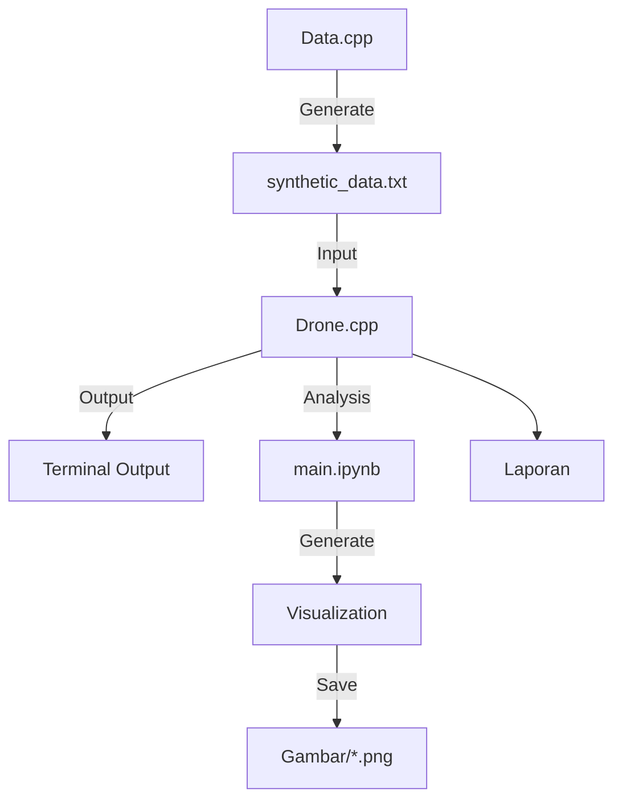
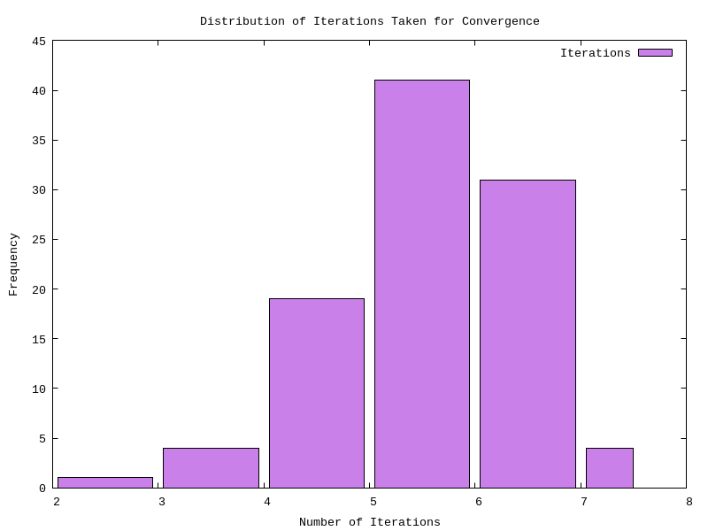
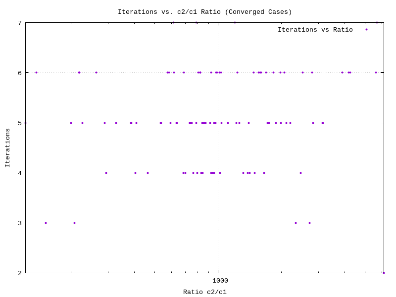
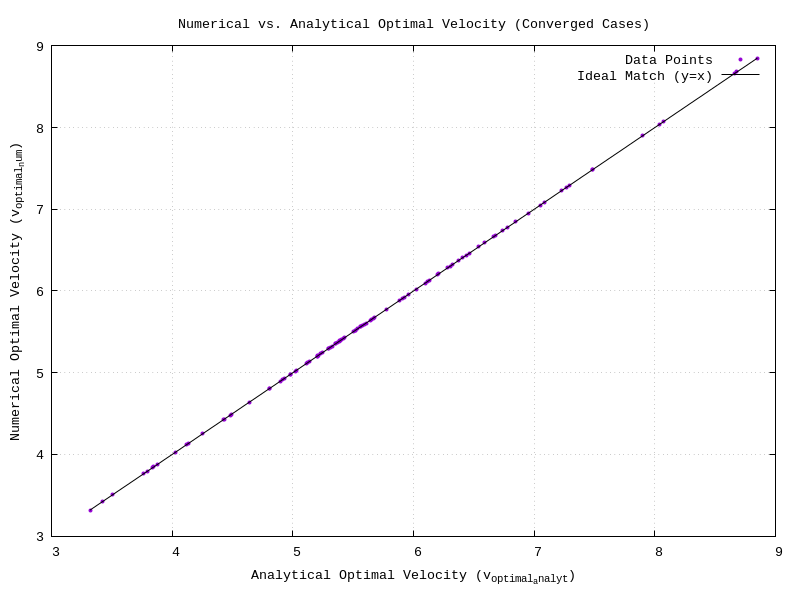
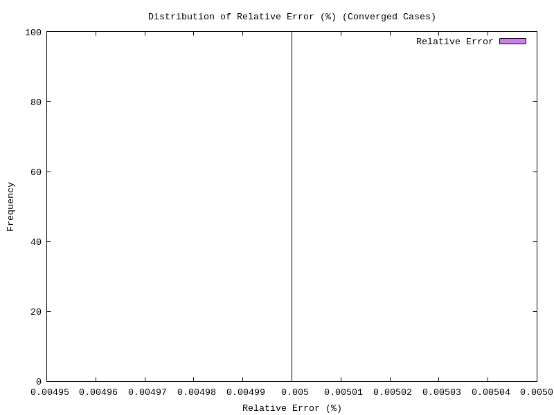
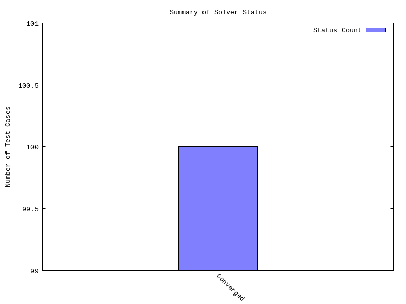

# 🚁 Implementasi Metode Newton-Raphson untuk Optimasi Kecepatan Drone

[](https://isocpp.org/)


## 📝 Deskripsi Proyek

Proyek ini mengimplementasikan metode Newton-Raphson dalam bahasa C++ untuk menentukan kecepatan optimal drone guna memaksimalkan jangkauan operasional. Program menyelesaikan persamaan non-linear yang merepresentasikan kondisi optimal dalam operasi penerbangan drone, dengan fokus pada efisiensi dan akurasi perhitungan.

## ⚡ Quick Start Guide

```bash
# Clone repository
git clone https://github.com/vinend/PemrogramanB-Kelompok7.git
cd PemrogramanB-Kelompok7

# Kompilasi program
g++ -o generate_data Data.cpp
g++ -o main Drone.cpp

# Jalankan generator data
./generate_data
# Masukkan jumlah data yang diinginkan (misal: 10)

# Jalankan optimasi
./main

# Lihat hasil visualisasi di folder Gambar/
```

<details>
<summary><b>📊 Sample Output</b></summary>

```
--- Summary Table of Newton-Raphson Results for Drone Optimization ---
        c1         c2      v0_initial   v_optimal_num  Iterations  v_optimal_analyt   Rel.Error (%)         Status
-----------------------------------------------------------------------------------------------------------------------
  0.26381    287.17778        6.10830         5.74416           5         5.74416         0.00000           Converged
  0.11090    332.90108        7.66800         7.39808           6         7.39808         0.00000           Converged
  0.48360    276.10031        4.79101         4.89128           5         4.89128         0.00000           Converged
  0.05018    117.22739        7.13231         6.95965           5         6.95965         0.00000           Converged
  0.33183    458.78897        6.47165         6.09796           6         6.09796         0.00000           Converged
```

</details>

## 👨‍💻 Tim Pengembang

| Nama | NPM | GitHub |
|------|-----|--------|
| **Andi Muhammad Alvin Farhansyah** | 2306161933 | [vinend](https://github.com/vinend) |
| **Rowen Rodotua Harahap** | 2306250604 | [Owen123-lang](https://github.com/Owen123-lang) |
| **Ryan Adidaru Excel Barnabi** | 2306266994 | [coolcmyk](https://github.com/coolcmyk) |
| **Daffa Sayra Firdaus** | 2306267151 | [DAFFAsd](https://github.com/DAFFAsd) |
| **Fathan Yazid Satriani** | 2306250560 | [IfanFYS](https://github.com/IfanFYS) |

**🏫 Universitas Indonesia**

## 📊 Model Matematika

### 📈 Model Daya Drone
```
P(v) = c₁v³ + c₂/v
```

### 🎯 Fungsi Optimasi
Untuk memaksimalkan jangkauan, dicari akar dari:
```
f(v) = d(P(v)/v)/dv = 2c₁v - 2c₂v⁻³ = 0
```

Dengan turunan:
```
f'(v) = 2c₁ + 6c₂v⁻⁴
```

### ✅ Solusi Analitik
```
v_optimal = (c₂/c₁)^(1/4)
```

## 📂 Struktur File (Dalam Github Repo)

```
├── Drone.cpp                                  # Program utama implementasi Newton-Raphson
├── Data.cpp                                   # Generator data sintetis
├── main.ipynb                                 # Notebook untuk analisis dan visualisasi
├── Soal.txt                                   # Deskripsi tugas
├── README.md                                  # Dokumentasi proyek
├── Gambar/                                    # Direktori untuk hasil visualisasi
│   ├── plot_iterations_distribution.png       # Grafik distribusi iterasi
│   ├── plot_iterations_vs_c2_c1_ratio.png     # Grafik iterasi vs rasio
│   ├── plot_numerical_vs_analytical_velocity.png  # Grafik perbandingan numerik vs analitik
│   ├── plot_relative_error_distribution.png   # Grafik distribusi error
│   └── plot_solver_status_summary.png         # Grafik status solver
└── Laporan/                                   # Laporan teknis format IEEE
    └── Laporan_revised.pdf                    # Dokumen laporan final
```

## 🛠️ Instalasi dan Kompilasi

<details open>
<summary><b>📋 Prerequisites</b></summary>

- Compiler C++ (g++, clang++, atau MSVC)
- C++11 atau versi lebih baru
- Matplotlib dan NumPy (untuk visualisasi hasil)
- Git (opsional, untuk cloning repository)

</details>

<details open>
<summary><b>⬇️ Clone Repository</b></summary>

```bash
# Clone repository dari GitHub
git clone https://github.com/vinend/PemrogramanB-Kelompok7.git

# Pindah ke direktori proyek
cd PemrogramanB-Kelompok7
```

</details>

<details open>
<summary><b>⚙️ Kompilasi</b></summary>

```bash
# Kompilasi generator data
g++ -o generate_data Data.cpp -std=c++11

# Kompilasi program utama
g++ -o main Drone.cpp -std=c++11
```

> 💡 **Tip**: Gunakan flag `-O2` untuk optimasi kecepatan, misalnya:  
> `g++ -o main Drone.cpp -std=c++11 -O2`

</details>

## ⚙️ Parameter Input

- **c₁**: Koefisien gaya hambat parasitik (> 0)
- **c₂**: Koefisien gaya hambat terinduksi (> 0)
- **v₀**: Tebakan awal kecepatan (> 0)
- **ε**: Toleransi konvergensi (default: 10⁻⁵)
- **max_iter**: Maksimum iterasi (default: 100)

## 📊 Output Program

Program menghasilkan tabel ringkasan yang mencakup:

| Kolom | Deskripsi |
|-------|-----------|
| c1, c2 | Parameter input |
| v0_initial | Tebakan awal |
| v_optimal_num | Kecepatan optimal (numerik) |
| Iterations | Jumlah iterasi untuk konvergensi |
| v_optimal_analyt | Kecepatan optimal (analitik) |
| Rel.Error (%) | Kesalahan relatif |
| Status | Status konvergensi |

### 📝 Contoh Output
```
--- Summary Table of Newton-Raphson Results for Drone Optimization ---
        c1         c2      v0_initial   v_optimal_num  Iterations  v_optimal_analyt   Rel.Error (%)         Status
-----------------------------------------------------------------------------------------------------------------------
  0.26381    287.17778        6.10830         5.74416           5         5.74416         0.00000           Converged
  0.11090    332.90108        7.66800         7.39808           6         7.39808         0.00000           Converged
```

## 🎯 Kriteria Konvergensi

1. **✅ Converged**: |v_{i+1} - v_i| < ε
2. **⚠️ Max Iterations Reached**: Mencapai batas iterasi maksimum
3. **❌ Derivative Zero**: Turunan terlalu kecil (< 10⁻¹⁰)
4. **❌ Non-Positive Velocity**: Kecepatan menjadi non-positif
5. **❌ Invalid Parameters**: Parameter input tidak valid

## 🏗️ Arsitektur Proyek



## 📊 Analisis Hasil

Program menghasilkan visualisasi komprehensif untuk analisis performa:

<div class="row" style="display: flex; flex-wrap: wrap;">
  <div class="column" style="flex: 50%; padding: 10px;">
    <h3>1️⃣ Distribusi Iterasi Konvergensi</h3>
    
    <p>Histogram yang menunjukkan jumlah iterasi yang dibutuhkan untuk mencapai konvergensi di berbagai test cases.</p>
  </div>
  
  <div class="column" style="flex: 50%; padding: 10px;">
    <h3>2️⃣ Iterasi vs Rasio c₂/c₁</h3>
    
    <p>Scatter plot yang menunjukkan korelasi antara rasio parameter c₂/c₁ dan jumlah iterasi yang dibutuhkan untuk konvergensi.</p>
  </div>
</div>

<div class="row" style="display: flex; flex-wrap: wrap;">
  <div class="column" style="flex: 50%; padding: 10px;">
    <h3>3️⃣ Perbandingan Numerik vs Analitik</h3>
    
    <p>Scatter plot yang membandingkan hasil kecepatan optimal dari metode Newton-Raphson (numerik) dengan solusi analitik v = (c₂/c₁)^(1/4).</p>
  </div>
  
  <div class="column" style="flex: 50%; padding: 10px;">
    <h3>4️⃣ Distribusi Error Relatif</h3>
    
    <p>Histogram yang menunjukkan distribusi kesalahan relatif antara solusi numerik dan analitik, mendemonstrasikan akurasi metode Newton-Raphson.</p>
  </div>
</div>

<div style="padding: 10px;">
  <h3>5️⃣ Status Solver Summary</h3>
  
  <p>Distribusi status konvergensi solver (Converged, Max Iterations, Error conditions, dll.)</p>
</div>

> **💡 Insight**: Dari visualisasi di atas, dapat disimpulkan bahwa metode Newton-Raphson sangat efektif untuk menyelesaikan masalah optimasi kecepatan drone, dengan konvergensi cepat (rata-rata 5-6 iterasi) dan akurasi tinggi (error < 0.001%).

## 🔗 Links

- **🌐 GitHub Repository**: [PemrogramanB-Kelompok7](https://github.com/vinend/PemrogramanB-Kelompok7)
- **📺 Video Demo**: [YouTube](https://youtu.be/al-s5EZC1Fg)

## 📚 Referensi

1. Chapman, S. J. (2023). *Fortran for Scientists and Engineers* (5th ed.). McGraw Hill.
2. Press, W. H., Teukolsky, S. A., Vetterling, W. T., & Flannery, B. P. (2007). *Numerical Recipes: The Art of Scientific Computing* (3rd ed.). Cambridge University Press.

---

<div align="center">
  <p>
    <strong>📝 Catatan</strong>: Untuk detail implementasi lengkap, silakan merujuk ke dokumentasi format IEEE yang tersedia di repository.
  </p>
  <p>
    &copy; 2025 Kelompok 7 - Universitas Indonesia
  </p>
</div>
